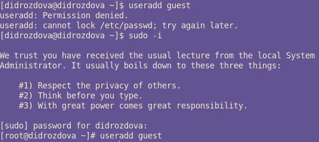
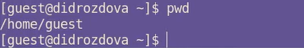
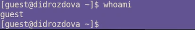

---
## Front matter
lang: ru-RU
title: Основы информационной безопасности
subtitle: Лабораторная работа №2
author:
  - Дроздова Д. И.
institute:
  - Российский университет дружбы народов, Москва, Россия
date: 01 марта 2024

## i18n babel
babel-lang: russian
babel-otherlangs: english

## Formatting pdf
toc: false
toc-title: Содержание
slide_level: 2
aspectratio: 169
section-titles: true
theme: metropolis
header-includes:
 - \metroset{progressbar=frametitle,sectionpage=progressbar,numbering=fraction}
 - '\makeatletter'
 - '\beamer@ignorenonframefalse'
 - '\makeatother'
---

# Вводная часть

## Цели и задачи

- Создать шаблон презентации в Markdown
- Описать алгоритм создания выходных форматов презентаций

# Лабораторная работа №2

## useradd guest
   Эта команда создает нового пользователя с именем "guest".

   

## passwd guest
   Эта команда устанавливает пароль для пользователя "guest".

   
   
   
   
   

## whoami
   Эта команда показывает текущего пользователя.

   

## id, groups
   Эта команда показывает информацию о пользователе, включая имя, группу и ID.

   
   
   
   
   

## ls -l /home/
   Эта команда показывает содержимое директории "/home" с подробной информацией о файлах и директориях, включая права доступа.

   

## lsattr /home
   Эта команда показывает расширенные атрибуты директорий.

   

## mkdir dir1
   Эта команда создает новую директорию с именем "dir1".

   

## chmod 000 dir1
   Эта команда устанавливает права доступа к директории "dir1" на "000", что означает отсутствие прав доступа для всех пользователей.

   

## echo "test" > /home/guest/dir1/file1
   Эта команда пытается создать файл "file1" внутри директории "dir1", но из-за отсутствия прав доступа к директории не удается выполнить операцию.

   

   

# Результаты

В ходе выполнения данной лабораторной работы мы получили практические навыки работы в консоли с атрибутами файлов, закрепили теоретические основы дискреционного разграничения доступа в современных системах с открытым кодом на базе ОС Linux.

