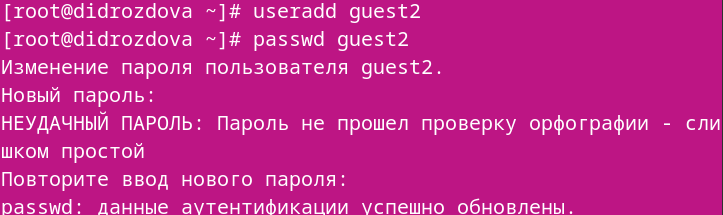
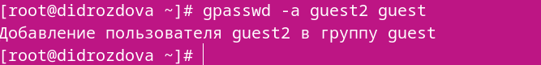
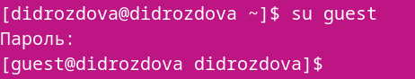
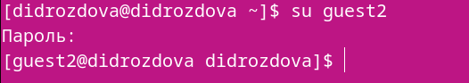
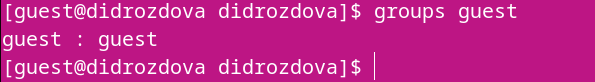
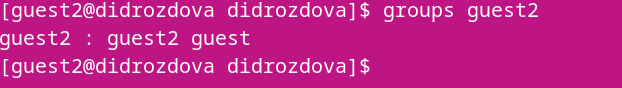
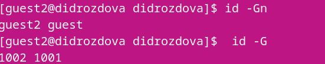
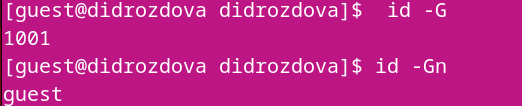
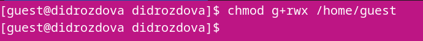
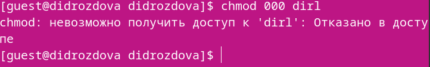

---
## Front matter
lang: ru-RU
title: Основы информационной безопасности
subtitle: Лабораторная работа №3
author:
  - Дроздова Д. И.
institute:
  - Российский университет дружбы народов, Москва, Россия
date: 14 марта 2024

## i18n babel
babel-lang: russian
babel-otherlangs: english

## Formatting pdf
toc: false
toc-title: Содержание
slide_level: 2
aspectratio: 169
section-titles: true
theme: metropolis
header-includes:
 - \metroset{progressbar=frametitle,sectionpage=progressbar,numbering=fraction}
 - '\makeatletter'
 - '\beamer@ignorenonframefalse'
 - '\makeatother'
---

# Вводная часть

## Цели и задачи

Получение практических навыков работы в консоли с атрибутами файлов для групп пользователей.

# Лабораторная работа №3

##
     В установленной операционной системе создайте учётную запись поль-
    зователя guest (использую учётную запись администратора):
    *useradd guest*

##
    Задайте пароль для пользователя guest (использую учётную запись ад-
    министратора):
    *passwd gАналогично создайте второго пользователя guest2.

    

##
    Добавьте пользователя guest2 в группу guest:
    *gpasswd -a guest2 guest*

    

##
    Осуществите вход в систему от двух пользователей на двух разных кон-
    солях: guest на первой консоли и guest2 на второй консоли.

    

    

##
    Для обоих пользователей командой pwd определите директорию, в кото-
    рой вы находитесь. Сравните её с приглашениями командной строки.

    

    

##
    Уточните имя вашего пользователя, его группу, кто входит в неё
    и к каким группам принадлежит он сам. Определите командами
    groups guest и groups guest2, в какие группы входят пользовате-
    ли guest и guest2. Сравните вывод команды groups с выводом команд
    *id -Gn* и *id -G*:

##

    

    

##

    

    

##
    Сравните полученную информацию с содержимым файла /etc/group.
    Просмотрите файл командой
    *cat /etc/group*

    

##
    От имени пользователя guest2 выполните регистрацию пользователя
    guest2 в группе guest командой
    *newgrp guest*

    

##
    От имени пользователя guest измените права директории /home/guest,
    разрешив все действия для пользователей группы:
    *chmod g+rwx /home/guest*

    

##
    От имени пользователя guest снимите с директории /home/guest/dir1
    все атрибуты командой
    *chmod 000 dirl*

    

# Выводы

##
    В ходе выполнения данной лабораторной работы мы получили    практические навыки работы в консоли с атрибутами файлов для групп пользователей.

