---
## Front matter
title: "Основы информационной безопасности"
subtitle: "Лабораторная работа №3"
author: "Дарья Игоревна Дроздова"

## Generic otions
lang: ru-RU
toc-title: "Содержание"

## Bibliography
bibliography: bib/cite.bib
csl: pandoc/csl/gost-r-7-0-5-2008-numeric.csl

## Pdf output format
toc: true # Table of contents
toc-depth: 2
lof: true # List of figures
lot: true # List of tables
fontsize: 12pt
linestretch: 1.5
papersize: a4
documentclass: scrreprt
## I18n polyglossia
polyglossia-lang:
  name: russian
  options:
	- spelling=modern
	- babelshorthands=true
polyglossia-otherlangs:
  name: english
## I18n babel
babel-lang: russian
babel-otherlangs: english
## Fonts
mainfont: PT Serif
romanfont: PT Serif
sansfont: PT Sans
monofont: PT Mono
mainfontoptions: Ligatures=TeX
romanfontoptions: Ligatures=TeX
sansfontoptions: Ligatures=TeX,Scale=MatchLowercase
monofontoptions: Scale=MatchLowercase,Scale=0.9
## Biblatex
biblatex: true
biblio-style: "gost-numeric"
biblatexoptions:
  - parentracker=true
  - backend=biber
  - hyperref=auto
  - language=auto
  - autolang=other*
  - citestyle=gost-numeric
## Pandoc-crossref LaTeX customization
figureTitle: "Рис."
tableTitle: "Таблица"
listingTitle: "Листинг"
lofTitle: "Список иллюстраций"
lotTitle: "Список таблиц"
lolTitle: "Листинги"
## Misc options
indent: true
header-includes:
  - \usepackage{indentfirst}
  - \usepackage{float} # keep figures where there are in the text
  - \floatplacement{figure}{H} # keep figures where there are in the text
---

# Цель работы

Получение практических навыков работы в консоли с атрибутами файлов для групп пользователей.

# Выполнение лабораторной работы

1. В установленной операционной системе создайте учётную запись поль-
зователя guest (использую учётную запись администратора):
*useradd guest*

2. Задайте пароль для пользователя guest (использую учётную запись ад-
министратора):
*passwd guest*

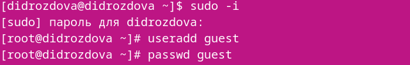{#fig:001 width=70%}

3. Аналогично создайте второго пользователя guest2.

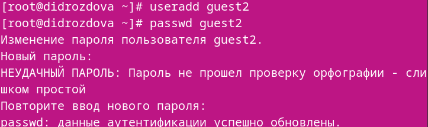{#fig:001 width=70%}

4. Добавьте пользователя guest2 в группу guest:
*gpasswd -a guest2 guest*

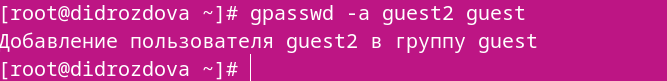{#fig:001 width=70%}

5. Осуществите вход в систему от двух пользователей на двух разных кон-
солях: guest на первой консоли и guest2 на второй консоли.

{#fig:001 width=70%}

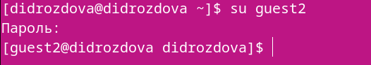{#fig:001 width=70%}

6. Для обоих пользователей командой pwd определите директорию, в кото-
рой вы находитесь. Сравните её с приглашениями командной строки.

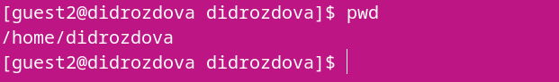{#fig:001 width=70%}

{#fig:001 width=70%}

7. Уточните имя вашего пользователя, его группу, кто входит в неё
и к каким группам принадлежит он сам. Определите командами
groups guest и groups guest2, в какие группы входят пользовате-
ли guest и guest2. Сравните вывод команды groups с выводом команд
*id -Gn* и *id -G*:

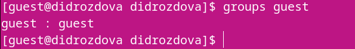{#fig:001 width=70%}

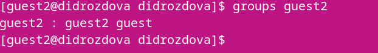{#fig:001 width=70%}

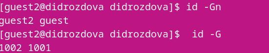{#fig:001 width=70%}

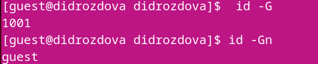{#fig:001 width=70%}

8. Сравните полученную информацию с содержимым файла /etc/group.
Просмотрите файл командой
*cat /etc/group*

{#fig:001 width=70%}

9. От имени пользователя guest2 выполните регистрацию пользователя
guest2 в группе guest командой
*newgrp guest*

{#fig:001 width=70%}

10. От имени пользователя guest измените права директории /home/guest,
разрешив все действия для пользователей группы:
*chmod g+rwx /home/guest*

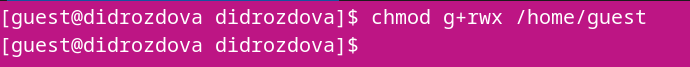{#fig:001 width=70%}

11. От имени пользователя guest снимите с директории /home/guest/dir1
все атрибуты командой
*chmod 000 dirl*

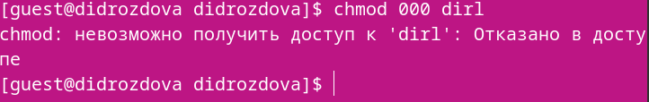{#fig:001 width=70%}

# Выводы

В ходе выполнения данной лабораторной работы мы получили практические навыки работы в консоли с атрибутами файлов для групп пользователей.
