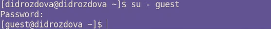

---
## Front matter
title: "Основы информационной безопасности"
subtitle: "Лабораторная работа №2"
author: "Дарья Игоревна Дроздова"

## Generic otions
lang: ru-RU
toc-title: "Содержание"

## Bibliography
bibliography: bib/cite.bib
csl: pandoc/csl/gost-r-7-0-5-2008-numeric.csl

## Pdf output format
toc: true # Table of contents
toc-depth: 2
lof: true # List of figures
lot: true # List of tables
fontsize: 12pt
linestretch: 1.5
papersize: a4
documentclass: scrreprt
## I18n polyglossia
polyglossia-lang:
  name: russian
  options:
	- spelling=modern
	- babelshorthands=true
polyglossia-otherlangs:
  name: english
## I18n babel
babel-lang: russian
babel-otherlangs: english
## Fonts
mainfont: PT Serif
romanfont: PT Serif
sansfont: PT Sans
monofont: PT Mono
mainfontoptions: Ligatures=TeX
romanfontoptions: Ligatures=TeX
sansfontoptions: Ligatures=TeX,Scale=MatchLowercase
monofontoptions: Scale=MatchLowercase,Scale=0.9
## Biblatex
biblatex: true
biblio-style: "gost-numeric"
biblatexoptions:
  - parentracker=true
  - backend=biber
  - hyperref=auto
  - language=auto
  - autolang=other*
  - citestyle=gost-numeric
## Pandoc-crossref LaTeX customization
figureTitle: "Рис."
tableTitle: "Таблица"
listingTitle: "Листинг"
lofTitle: "Список иллюстраций"
lotTitle: "Список таблиц"
lolTitle: "Листинги"
## Misc options
indent: true
header-includes:
  - \usepackage{indentfirst}
  - \usepackage{float} # keep figures where there are in the text
  - \floatplacement{figure}{H} # keep figures where there are in the text
---

# Цель работы

Получение практических навыков работы в консоли с атрибутами фай-
лов, закрепление теоретических основ дискреционного разграничения до-
ступа в современных системах с открытым кодом на базе ОС Linux.

# Выполнение лабораторной работы

## 1. useradd guest
   Эта команда создает нового пользователя с именем "guest".

   

## 2. passwd guest
   Эта команда устанавливает пароль для пользователя "guest".

   
   
   
   
   

## 3. whoami
   Эта команда показывает текущего пользователя.

   

## 4. id, groups
   Эта команда показывает информацию о пользователе, включая имя, группу и ID.

   
   
   
   
   

## 5. ls -l /home/
   Эта команда показывает содержимое директории "/home" с подробной информацией о файлах и директориях, включая права доступа.

   

## 6. lsattr /home
   Эта команда показывает расширенные атрибуты директорий.

   

## 7. mkdir dir1
   Эта команда создает новую директорию с именем "dir1".

   

## 8. chmod 000 dir1
   Эта команда устанавливает права доступа к директории "dir1" на "000", что означает отсутствие прав доступа для всех пользователей.

   

## 9. echo "test" > /home/guest/dir1/file1
   Эта команда пытается создать файл "file1" внутри директории "dir1", но из-за отсутствия прав доступа к директории не удается выполнить операцию.

   

   

# Выводы

В ходе выполнения данной лабораторной работы мы получили практические навыки работы в консоли с атрибутами файлов, закрепили теоретические основы дискреционного разграничения доступа в современных системах с открытым кодом на базе ОС Linux.

